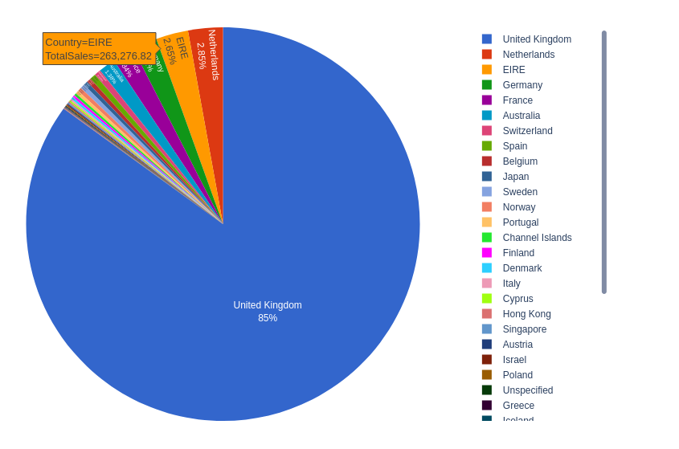

# Analytics to Boost Sells

## Overview
This project explores the power of data visualization using Plotnine and Plotly, two popular Python libraries. The aim is to effectively communicate insights from various datasets through informative and visually appealing charts and plots.

## Website
You can explore the visualizations on the [Data Visualization Project Website](https://harshrajshs.github.io/Data_visualization/).

## Libraries Used
- **Plotnine:** A Python implementation of the ggplot2 library from R, known for its declarative and grammar-of-graphics approach.
- **Plotly:** An interactive visualization library that creates dynamic and web-based plots and dashboards.

## Project Structure
The project is organized as follows:

### Dataset
The dataset used in this project can be found [here](https://www.kaggle.com/datasets/lakshmi25npathi/online-retail-dataset).

- **notebook/:** Jupyter notebooks where the data exploration, analysis, and visualization code resides.
- **HTML files/:** downloaded the responsive charts as html and added to index.html.

## Usage
To reproduce the results and visualizations, follow these steps:

1. Clone the repository: `git clone https://github.com/your_username/data-visualization-project.git`
2. Open the Jupyter notebook in the and execute the code cells.
3. The generated visualizations will be saved in the current directory.

## Results
The project includes the following visualizations:

- Pie Chart
- Bar Chart
- Scatter Plot
- Line Chart
- Histogram
- Box Plot
- Heatmap
- Responsive Map chart

## Conclusion
By utilizing Plotnine and Plotly, this project showcases the effectiveness of data visualization in communicating insights. The resulting charts and plots provide a clear and intuitive understanding of the data, making it easier to identify patterns, trends, and outliers.

## References
- [Plotnine Documentation](https://plotnine.readthedocs.io/)
- [Plotly Documentation](https://plotly.com/python/)

## License
This project is licensed under the MIT License.

Feel free to explore and extend the project further! Any contributions or suggestions are welcome.

## Contact
For any queries, contact me at [harshiitg2025@gmail.com](mailto:harshiitg2025@gmail.com).
